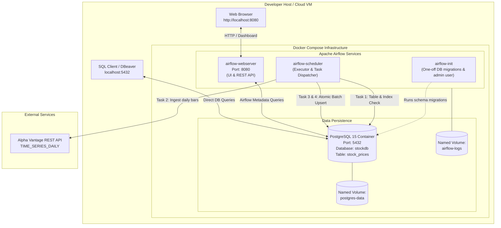
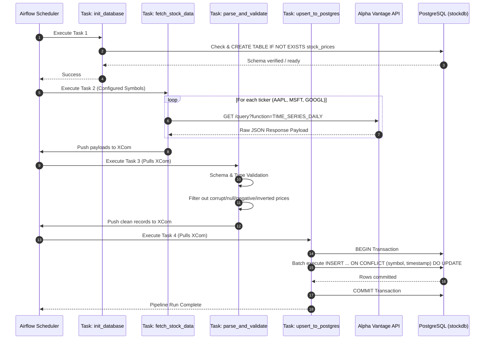
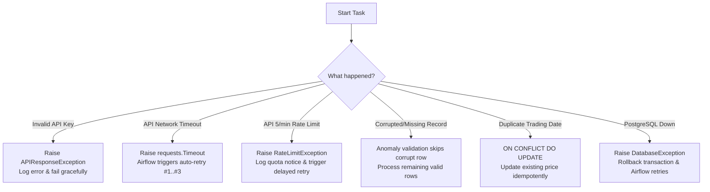

# Production-Grade Stock Market Data Pipeline

[](https://www.python.org/)
[](https://airflow.apache.org/)
[](https://www.postgresql.org/)
[](https://www.docker.com/)
[](tests/)

An end-to-end, resilient, containerized data engineering pipeline that automatically extracts, validates, sanitizes, and loads daily stock market time-series data from the **Alpha Vantage API** into a production **PostgreSQL** relational database. Orchestrated, monitored, and scheduled via **Apache Airflow** using **Docker Compose**.

---

## Quick Navigation

* [1. System Architecture](#1-system-architecture)
* [2. Host Endpoints & Access Guide](#2-host-endpoints--access-guide)
* [3. Do I Need to Open Docker? (Step-by-Step)](#3-do-i-need-to-open-docker-step-by-step)
* [4. Quick Start Runbook](#4-quick-start-runbook)
* [5. Database Schema & Data Modeling](#5-database-schema--data-modeling)
* [6. Pipeline Workflow & DAG Tasks](#6-pipeline-workflow--dag-tasks)
* [7. Resilience & Failure Scenarios (The 6 Pillars)](#7-resilience--failure-scenarios-the-6-pillars)
* [8. Testing & Verification](#8-testing--verification)
* [9. Production Deployment Guide](#9-production-deployment-guide)
* [10. Troubleshooting Playbook](#10-troubleshooting-playbook)
* [11. Commands Cheatsheet](#11-commands-cheatsheet)

---

## 1. System Architecture

### High-Level Component Topology



### DAG Execution & Data Flow Lineage



---

## 2. Host Endpoints & Access Guide

When the Docker Compose stack is running, all core services are bound directly to your local workstation ports:

| Service | Host URL / Endpoint | Protocol / Port | Default Credentials | Description |
| :--- | :--- | :--- | :--- | :--- |
| **Airflow Web UI** | [http://localhost:8080](http://localhost:8080) | HTTP (`8080`) | **User**: `admin`<br/>**Pass**: `admin` | Airflow graphical interface for DAG visualization, triggering manual runs, reviewing task logs, and inspecting Gantt charts. |
| **Airflow Healthcheck** | [http://localhost:8080/health](http://localhost:8080/health) | HTTP (`8080`) | *None (Public)* | Health monitoring endpoint providing JSON status of webserver and scheduler processes. |
| **PostgreSQL Database** | `localhost` | TCP (`5432`) | **Host**: `localhost`<br/>**Port**: `5432`<br/>**User**: `stockuser`<br/>**Pass**: `stockpassword`<br/>**DB**: `stockdb` | Direct relational database access from host tools like DBeaver, TablePlus, pgAdmin, or CLI `psql`. |
| **Internal Docker DB Host** | `postgres:5432` | TCP (`5432`) | *(Same as above)* | Internal hostname used exclusively by containerized Airflow to communicate with PostgreSQL over the `pipeline-network` bridge. |

---

## 3. Do I Need to Open Docker? (Step-by-Step)

> **YES, Docker must be open and running** before launching the pipeline containers.

### How to Check and Open Docker on Windows:
1. **Open Docker Desktop**: Press the Windows key, search for **Docker Desktop**, and open it.
2. **Check the Whale Icon**: Look at your Windows notification tray (bottom-right near the clock). Wait until the Docker whale icon turns **solid green** and says **"Engine running"**.
3. **If Docker is not installed**:
   * Download the installer from the official site: [Docker Desktop for Windows](https://www.docker.com/products/docker-desktop/)
   * Or install via Windows Terminal (Admin):
     ```powershell
     winget install Docker.DockerDesktop
     ```
   * Ensure the **WSL2 backend** option is checked during setup.
4. Once Docker Desktop is running, you can execute all pipeline commands from your terminal!

---

## 4. Quick Start Runbook

### Method A: 1-Click Launchers (Easiest)

* **Windows Command Prompt / Double-click**:
  Double-click `run_pipeline.bat` or run:
  ```cmd
  run_pipeline.bat
  ```
* **PowerShell**:
  ```powershell
  .\run_pipeline.ps1
  ```

---

### Method B: Manual Command-Line Workflow

#### Step 1: Clone or Navigate to Project
```powershell
cd d:\Kishore\New_project\stock-data-pipeline
```

#### Step 2: Configure Environment Variables
Verify or edit `.env` (a production-ready `.env` with a working Alpha Vantage API key is already configured in this repository):
```ini
ALPHA_VANTAGE_API_KEY=V6W3UHOMOHKHE1G5
POSTGRES_HOST=postgres
POSTGRES_PORT=5432
POSTGRES_DB=stockdb
POSTGRES_USER=stockuser
POSTGRES_PASSWORD=stockpassword
STOCK_SYMBOLS=AAPL,MSFT,GOOGL
AIRFLOW_ADMIN_USER=admin
AIRFLOW_ADMIN_PASSWORD=admin
AIRFLOW_ADMIN_EMAIL=admin@example.com
```

#### Step 3: Build and Start Containers
```bash
docker compose up --build -d
```
*Docker Compose will build the custom Airflow image, create the shared bridge network, spin up PostgreSQL with initialization scripts, run Airflow DB migrations, and launch the Webserver and Scheduler.*

#### Step 4: Verify Container Status
```bash
docker compose ps
```
You should see:
```text
NAME                IMAGE                         COMMAND                  SERVICE             CREATED          STATUS                    PORTS
airflow_init        stock-pipeline-airflow:latest "bash -c 'echo 'Runn…"   airflow-init        10 seconds ago   Exited (0)               
airflow_scheduler   stock-pipeline-airflow:latest "scheduler"              airflow-scheduler   10 seconds ago   Up 8 seconds (healthy)    
airflow_webserver   stock-pipeline-airflow:latest "webserver"              airflow-webserver   10 seconds ago   Up 8 seconds (healthy)    0.0.0.0:8080->8080/tcp
stock_postgres      postgres:15-alpine            "docker-entrypoint.s…"   postgres            10 seconds ago   Up 9 seconds (healthy)    0.0.0.0:5432->5432/tcp
```

#### Step 5: Access the Airflow UI
1. Open your browser to [http://localhost:8080](http://localhost:8080)
2. Log in with:
   * **Username**: `admin`
   * **Password**: `admin`
3. Locate the DAG: `stock_market_data_pipeline`.
4. The DAG is unpaused by default. You can trigger a run immediately by clicking the **Trigger DAG** (▶) button on the right, or via CLI:
   ```bash
   docker compose exec airflow-webserver airflow dags trigger stock_market_data_pipeline
   ```

---

## 5. Database Schema & Data Modeling

The data schema is initialized via `sql/init.sql` and reinforced programmatically at runtime by `stock_pipeline.py`.

### Entity Relationship & Schema Definition

```sql
CREATE TABLE IF NOT EXISTS stock_prices (
    id SERIAL PRIMARY KEY,
    symbol VARCHAR(10) NOT NULL,
    timestamp DATE NOT NULL,
    open NUMERIC(12, 4) NOT NULL,
    high NUMERIC(12, 4) NOT NULL,
    low NUMERIC(12, 4) NOT NULL,
    close NUMERIC(12, 4) NOT NULL,
    volume BIGINT NOT NULL,
    created_at TIMESTAMP WITH TIME ZONE DEFAULT CURRENT_TIMESTAMP,
    updated_at TIMESTAMP WITH TIME ZONE DEFAULT CURRENT_TIMESTAMP,
    CONSTRAINT uq_symbol_timestamp UNIQUE (symbol, timestamp)
);

CREATE INDEX IF NOT EXISTS idx_stock_prices_symbol_timestamp
ON stock_prices (symbol, timestamp DESC);
```

### Data Dictionary

| Column | Data Type | Constraints | Description |
| :--- | :--- | :--- | :--- |
| `id` | `SERIAL` | Primary Key, Auto-increment | Unique synthetic identifier for every row. |
| `symbol` | `VARCHAR(10)` | NOT NULL | Stock ticker symbol (e.g., `AAPL`, `MSFT`, `GOOGL`). |
| `timestamp` | `DATE` | NOT NULL | Market trading session date (`YYYY-MM-DD`). |
| `open` | `NUMERIC(12, 4)` | NOT NULL | Opening market price in USD. |
| `high` | `NUMERIC(12, 4)` | NOT NULL | Day's highest traded price in USD. |
| `low` | `NUMERIC(12, 4)` | NOT NULL | Day's lowest traded price in USD. |
| `close` | `NUMERIC(12, 4)` | NOT NULL | Closing market price in USD. |
| `volume` | `BIGINT` | NOT NULL | Total number of shares transacted. |
| `created_at` | `TIMESTAMPTZ` | DEFAULT CURRENT_TIMESTAMP | Timestamp when the row was first inserted. |
| `updated_at` | `TIMESTAMPTZ` | DEFAULT CURRENT_TIMESTAMP | Timestamp when the row was updated during an upsert. |

### Indexing & Performance Strategy
* **Compound Unique Constraint (`uq_symbol_timestamp`)**: Enforces data integrity at the database storage engine level, preventing duplicate records for the same ticker on the same trading date.
* **Composite B-Tree Index (`idx_stock_prices_symbol_timestamp`)**: Accelerates quantitative time-series lookups filtering by symbol and sorting by date descending (e.g. `WHERE symbol = 'AAPL' ORDER BY timestamp DESC`).

---

## 6. Pipeline Workflow & DAG Tasks

The DAG `stock_market_data_pipeline` is defined in `dags/stock_pipeline_dag.py` and consists of 4 linear, decoupled tasks:

```text
[initialize_database] ──► [fetch_stock_data] ──► [parse_and_validate] ──► [upsert_to_postgres]
```

1. **`initialize_database`**:
   * Connects to PostgreSQL using configured credentials.
   * Executes DDL to create `stock_prices` and secondary index if not already present.
   * Verifies database health before initiating external API requests.
2. **`fetch_stock_data`**:
   * Reads configured symbols from environment (`STOCK_SYMBOLS`).
   * Iterates through tickers, querying the Alpha Vantage `TIME_SERIES_DAILY` endpoint.
   * Handles timeouts (15s), HTTP status codes, and rate-limit detection.
   * Returns dictionary of raw JSON payloads to Airflow XCom.
3. **`parse_and_validate`**:
   * Extracts raw JSON payloads from XCom.
   * Validates ISO-8601 date parsing (`YYYY-MM-DD`).
   * Validates presence and numeric conversion of all OHLCV fields.
   * Validates price logic (`low <= high`, all prices positive, volume positive).
   * Safely skips corrupt rows while preserving clean rows.
   * Pushes clean record list to XCom.
4. **`upsert_to_postgres`**:
   * Pulls clean records from XCom.
   * Performs an atomic batch upsert via `psycopg2.extras.execute_batch`.
   * Utilizes `ON CONFLICT (symbol, timestamp) DO UPDATE` to update existing prices and bump `updated_at`.
   * Commits the transaction and logs total modified rows.

---

## 7. Resilience & Failure Scenarios (The 6 Pillars)

The pipeline is rigorously engineered to withstand real-world distributed system failures:



### Breakdown of the 6 Scenarios & Test Coverage

| # | Scenario | Root Cause | System Behavior & Mitigation | Unit Test |
| :-: | :--- | :--- | :--- | :--- |
| **1** | **Invalid API Key** | Missing, malformed, or rejected API key in request. | Detects error payload from API; raises `APIResponseException`; logs actionable error message without exposing credentials. | `test_scenario_1_invalid_api_key` |
| **2** | **API Timeout** | Remote Alpha Vantage endpoint latency or packet drop. | 15-second request timeout trips; raises `requests.exceptions.Timeout`; Airflow default args automatically retry up to 3 times with 5-min delay. | `test_scenario_2_api_timeout` |
| **3** | **API Rate Limit** | Free tier limit exceeded (5 requests/min or 25 requests/day). | Inspects response for `"Note"` or `"Information"`; raises `RateLimitException`; Airflow orchestrates exponential backoff retry. | `test_scenario_3_api_rate_limit` |
| **4** | **Missing / Corrupt Data** | Payload has missing closing price, string for numbers, or negative volume. | Validation filter checks every OHLCV attribute; logs warning with exact date and reason; skips corrupt row and ingests valid rows. | `test_scenario_4_missing_stock_data` |
| **5** | **Duplicate Record** | Pipeline runs twice for the same date or re-runs a backfill. | PostgreSQL `ON CONFLICT (symbol, timestamp) DO UPDATE` updates prices without duplicate key violations; 100% idempotent. | `test_scenario_5_duplicate_record` |
| **6** | **PostgreSQL Unavailable** | Database container restarted or network partition. | Connection attempt catches socket failure; rolls back any uncommitted transactions; raises `DatabaseException`; Airflow retries. | `test_scenario_6_postgres_unavailable` |

---

## 8. Testing & Verification

### Running Automated Tests Locally
All 15 unit and scenario test cases run locally using Python `unittest`:
```powershell
python -m unittest discover -s tests -v
```

### Test Output Sample
```text
test_scenario_1_invalid_api_key (test_scenarios.TestScenarios) ... ok
test_scenario_2_api_timeout (test_scenarios.TestScenarios) ... ok
test_scenario_3_api_rate_limit (test_scenarios.TestScenarios) ... ok
test_scenario_4_missing_stock_data (test_scenarios.TestScenarios) ... ok
test_scenario_5_duplicate_record (test_scenarios.TestScenarios) ... ok
test_scenario_6_postgres_unavailable (test_scenarios.TestScenarios) ... ok
test_fetch_invalid_symbol_error_detection (test_stock_pipeline.TestStockPipeline) ... ok
test_fetch_missing_api_key (test_stock_pipeline.TestStockPipeline) ... ok
test_fetch_rate_limit_detection (test_stock_pipeline.TestStockPipeline) ... ok
test_parse_and_validate_valid_data (test_stock_pipeline.TestStockPipeline) ... ok
test_parse_empty_payload (test_stock_pipeline.TestStockPipeline) ... ok
test_parse_missing_and_corrupt_data_gracefully (test_stock_pipeline.TestStockPipeline) ... ok
test_upsert_empty_records (test_stock_pipeline.TestStockPipeline) ... ok
test_upsert_executes_batch_with_on_conflict (test_stock_pipeline.TestStockPipeline) ... ok
test_upsert_rolls_back_on_failure (test_stock_pipeline.TestStockPipeline) ... ok

----------------------------------------------------------------------
Ran 15 tests in 0.073s

OK
```

### Verifying Ingested Data in PostgreSQL

Run these commands in your host terminal to verify that data has been loaded:

#### 1. Check Total Ingested Row Count
```bash
docker compose exec postgres psql -U stockuser -d stockdb -c "SELECT count(*) FROM stock_prices;"
```

#### 2. View Breakdown by Symbol
```bash
docker compose exec postgres psql -U stockuser -d stockdb -c "
SELECT 
    symbol, 
    count(*) AS days_recorded, 
    min(timestamp) AS earliest_date, 
    max(timestamp) AS latest_date 
FROM stock_prices 
GROUP BY symbol;
"
```

#### 3. View Recent Prices
```bash
docker compose exec postgres psql -U stockuser -d stockdb -c "
SELECT symbol, timestamp, open, high, low, close, volume 
FROM stock_prices 
ORDER BY timestamp DESC 
LIMIT 10;
"
```

---

## 9. Production Deployment Guide

This pipeline is architected for seamless progression from local development to production cloud infrastructure:

### Option 1: Cloud Virtual Machine (AWS EC2 / GCP Compute Engine / Azure VM)
* Deploy the repository directly to an Ubuntu/Debian cloud VM.
* Install Docker and Docker Compose.
* Use `systemd` or Docker restart policies (`restart: unless-stopped`) to ensure 24/7 uptime.
* Attach an Elastic IP and configure Security Groups to restrict access to ports `8080` (Airflow UI) and `5432` (PostgreSQL).

### Option 2: Managed Cloud Airflow (PaaS)
* **AWS MWAA (Managed Workflows for Apache Airflow)** or **Google Cloud Composer**:
  * Copy `dags/stock_pipeline_dag.py` to the cloud Airflow DAGs S3 bucket or GCS bucket.
  * Package `scripts/stock_pipeline.py` as a Python wheel or place in the plugins/scripts directory.
  * Connect Airflow to **Amazon RDS for PostgreSQL** or **GCP Cloud SQL for PostgreSQL**.
  * Store credentials in **AWS Secrets Manager** or **GCP Secret Manager**.

### Option 3: Kubernetes with Helm (Enterprise Scale)
* Deploy the official **Apache Airflow Helm Chart**.
* Configure the `KubernetesExecutor` so each task runs in an isolated ephemeral pod.
* Use dedicated PostgreSQL stateful sets or an external managed database.

---

## 10. Troubleshooting Playbook

| Problem | Cause | Solution |
| :--- | :--- | :--- |
| **`docker` command not found** | Docker Desktop is not installed or not in system PATH. | Open Docker Desktop from Start Menu or install via `winget install Docker.DockerDesktop`. |
| **Port 8080 or 5432 already allocated** | Another local service (e.g. IIS, local Postgres) is using the port. | Change `POSTGRES_PORT` in `.env` to `5433` or edit `docker-compose.yml` webserver port mapping to `"8081:8080"`. |
| **Airflow UI shows "Cannot connect"** | Containers are still initializing or webserver crashed. | Run `docker compose ps` to inspect container states and `docker compose logs airflow-webserver` to see startup logs. |
| **DAG run failed with rate limit error** | Alpha Vantage free tier reached (5 calls/min limit). | Wait 1-2 minutes and trigger the DAG again. In production, configure an Alpha Vantage premium key. |
| **Database connection refused inside container** | Airflow tried to connect before Postgres was healthy. | Docker Compose uses `condition: service_healthy` on `postgres`. If needed, restart via `docker compose restart`. |

---

## 11. Commands Cheatsheet

For a complete, printable reference containing every operational and diagnostic command, see **[COMMANDS.md](COMMANDS.md)**.
