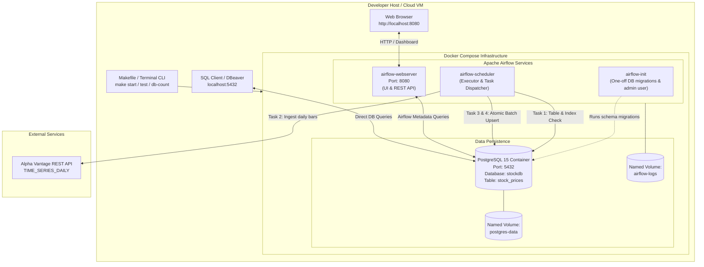
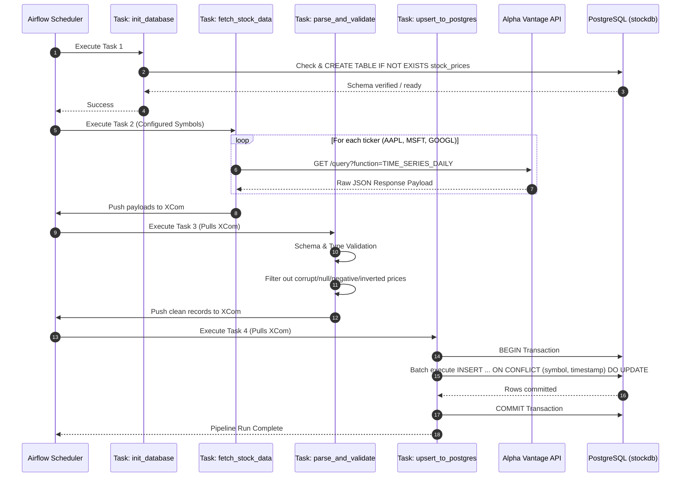
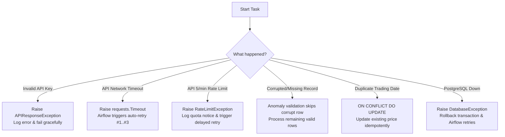

# Production-Grade Stock Market Data Pipeline

[](https://www.python.org/)
[](https://airflow.apache.org/)
[](https://www.postgresql.org/)
[](https://www.docker.com/)
[](tests/)
[](https://opensource.org/licenses/MIT)

An end-to-end, resilient, containerized data engineering pipeline that automatically extracts, validates, sanitizes, and loads daily stock market time-series data from the **Alpha Vantage API** into a production **PostgreSQL** relational database. Orchestrated, monitored, and scheduled via **Apache Airflow** using **Docker Compose** and automated via a developer-friendly **Makefile**.

---

## Quick Navigation

* [1. Technology Stack](#1-technology-stack)
* [2. System Architecture](#2-system-architecture)
* [3. Project Structure](#3-project-structure)
* [4. Host Endpoints & Access Guide](#4-host-endpoints--access-guide)
* [5. Prerequisites & System Requirements](#5-prerequisites--system-requirements)
* [6. Installation & Configuration](#6-installation--configuration)
* [7. Quick Start Runbook](#7-quick-start-runbook)
  * [Method A: Makefile Interface (Recommended)](#method-a-makefile-interface-recommended)
  * [Method B: 1-Click Launchers (Windows Native)](#method-b-1-click-launchers-windows-native)
  * [Method C: Manual Docker Compose Workflow](#method-c-manual-docker-compose-workflow)
* [8. Pipeline Workflow & DAG Tasks](#8-pipeline-workflow--dag-tasks)
* [9. Database Schema & Data Modeling](#9-database-schema--data-modeling)
* [10. Resilience & Error Handling (The 6 Pillars)](#10-resilience--error-handling-the-6-pillars)
* [11. Testing & Verification](#11-testing--verification)
* [12. Scalability & Production Evolution](#12-scalability--production-evolution)
* [13. Production Deployment Guide](#13-production-deployment-guide)
* [14. Troubleshooting Playbook](#14-troubleshooting-playbook)
* [15. Command Sheet & Reference](#15-command-sheet--reference)

---

## 1. Technology Stack

| Layer / Component | Technology | Version | Purpose & Architecture Justification |
| :--- | :--- | :--- | :--- |
| **Orchestration & Scheduling** | [Apache Airflow](https://airflow.apache.org/) | `2.8.1` | Programmatic DAG workflow definition, task retry policies, failure alerting, execution Gantt charts, and XCom data transfer. |
| **Relational Database** | [PostgreSQL](https://www.postgresql.org/) | `15-alpine` | ACID-compliant persistent storage with compound unique constraints (`symbol`, `timestamp`), B-tree indexing, and atomic batch upserts. |
| **Containerization** | [Docker](https://www.docker.com/) & [Docker Compose](https://docs.docker.com/compose/) | `v2+` | Fully reproducible, isolated multi-container runtime environment connecting services over an internal bridge network (`pipeline-network`). |
| **Core ETL Language** | [Python](https://www.python.org/) | `3.10+` | Clean, modular data pipeline implementation with type annotations, robust logging, and graceful exception handling. |
| **Database Driver** | [psycopg2-binary](https://pypi.org/project/psycopg2-binary/) | `2.9.9` | High-performance PostgreSQL adapter supporting parameterized SQL execution, batch upserting, and transaction rollbacks. |
| **HTTP / REST Client** | [requests](https://pypi.org/project/requests/) | `2.31.0` | Secure API client enforcing 15-second request timeouts, status validation, and rate limit response payload inspection. |
| **Automation & CLI** | [GNU Make](https://www.gnu.org/software/make/) | `v3.81+` | One-command interface for building, starting, health-checking, testing, querying, and tearing down pipeline infrastructure. |
| **External Data Source** | [Alpha Vantage API](https://www.alphavantage.co/) | REST API | Industry-standard financial market API providing daily adjusted time-series OHLCV equity bars. |
| **Testing Suite** | [Python unittest](https://docs.python.org/3/library/unittest.html) & [unittest.mock](https://docs.python.org/3/library/unittest.mock.html) | Built-in | 15 automated test cases testing edge conditions, API throttling, bad payloads, and network failures with zero external mocks required. |

---

## 2. System Architecture

### High-Level Component Topology



### DAG Execution & Data Flow Lineage



---

## 3. Project Structure

The codebase is structured according to production data engineering design principles, separating DAG orchestration, business logic, persistence scripts, infrastructure manifests, and automated testing:

```text
stock-data-pipeline/
├── dags/
│   └── stock_pipeline_dag.py     # Airflow DAG definition (4 tasks, daily schedule, retry policies)
├── scripts/
│   ├── stock_pipeline.py         # Core ETL logic (Extract, Validate, Upsert, DB init functions)
│   └── wait_for_services.py      # Healthcheck polling script for Airflow & Postgres readiness
├── sql/
│   └── init.sql                  # PostgreSQL initialization schema (DDL, constraints, indexes)
├── tests/
│   ├── __init__.py               # Test package indicator
│   ├── test_stock_pipeline.py    # Unit tests for individual pipeline logic methods
│   └── test_scenarios.py         # Resilience tests simulating the 6 real-world failure scenarios
├── .env.example                  # Environment variable configuration template
├── .env                          # Local environment variables (gitignored, contains actual secrets)
├── .gitignore                    # Git ignore file (excludes secrets, venvs, cache, containers)
├── COMMANDS.md                   # Comprehensive operational & diagnostic command sheet
├── docker-compose.yml            # Multi-container orchestration (Airflow, Postgres, Volumes, Networks)
├── Dockerfile                    # Custom Airflow image with Python requirements and scripts
├── Makefile                      # Developer & recruiter CLI automation interface
├── README.md                     # Comprehensive project documentation
├── requirements.txt              # Pipeline Python dependencies (psycopg2, requests, etc.)
├── run_pipeline.bat              # Native Windows 1-click batch launcher
└── run_pipeline.ps1              # Native Windows 1-click PowerShell launcher
```

### Key Source File Descriptions

* **`dags/stock_pipeline_dag.py`**: Defines the Airflow DAG `stock_market_data_pipeline`. Sets execution schedule (`@daily`), default retry policies (3 retries with 5-minute exponential backoff), and connects tasks via Airflow's task dependency syntax (`>>`).
* **`scripts/stock_pipeline.py`**: The decoupled Python module containing all business logic: `init_db()`, `fetch_stock_data()`, `parse_and_validate_data()`, and `upsert_stock_data()`. Can be executed independently or invoked by Airflow tasks.
* **`scripts/wait_for_services.py`**: Python synchronization script used by the `Makefile` and launch scripts to poll PostgreSQL socket and Airflow Webserver HTTP health endpoint before completing the startup sequence.
* **`sql/init.sql`**: Mounted into `/docker-entrypoint-initdb.d/init.sql` inside the PostgreSQL container to ensure the table and indexes exist immediately upon first database boot.
* **`tests/test_scenarios.py`**: Black-box and white-box simulation tests verifying how the pipeline reacts to API key failures, timeouts, rate limits, corrupt data, duplicates, and database unavailability.
* **`Makefile`**: Standard GNU Make automation file enabling developers to run `make start`, `make test`, `make trigger`, and `make db-count` without memorizing complex Docker or SQL commands.

---

## 4. Host Endpoints & Access Guide

When the Docker Compose stack is running, all core services are bound directly to your local workstation ports:

| Service | Host URL / Endpoint | Protocol / Port | Default Credentials | Description |
| :--- | :--- | :--- | :--- | :--- |
| **Airflow Web UI** | [http://localhost:8080](http://localhost:8080) | HTTP (`8080`) | **User**: `admin`<br/>**Pass**: `admin` | Airflow graphical interface for DAG visualization, triggering manual runs, reviewing task logs, and inspecting Gantt charts. |
| **Airflow Healthcheck** | [http://localhost:8080/health](http://localhost:8080/health) | HTTP (`8080`) | *None (Public)* | Health monitoring endpoint providing JSON status of webserver and scheduler processes. |
| **PostgreSQL Database** | `localhost` | TCP (`5432`) | **Host**: `localhost`<br/>**Port**: `5432`<br/>**User**: `stockuser`<br/>**Pass**: `stockpassword`<br/>**DB**: `stockdb` | Direct relational database access from host tools like DBeaver, TablePlus, pgAdmin, or CLI `psql`. |
| **Internal Docker DB Host** | `postgres:5432` | TCP (`5432`) | *(Same as above)* | Internal hostname used exclusively by containerized Airflow to communicate with PostgreSQL over the `pipeline-network` bridge. |

---

## 5. Prerequisites & System Requirements

Before running the pipeline, ensure the following software is installed on your workstation:

### Required Software
1. **Docker Desktop** (or Docker Engine + Docker Compose v2.0+):
   * Windows / Mac: [Docker Desktop](https://www.docker.com/products/docker-desktop/) (ensure the **WSL2 backend** is enabled on Windows).
   * Linux: `docker` and `docker compose plugin`.
2. **Git**:
   * Version control to clone the repository (`git --version`).
3. **Python 3.10+** (Required for local test execution and wait scripts):
   * Check version: `python --version` or `python3 --version`.
4. **Alpha Vantage API Key**:
   * Free, instant registration at [Alpha Vantage Claim Key](https://www.alphavantage.co/support/#api-key).

### Optional Tooling (Recommended)
* **GNU Make**:
  * Windows: Installed automatically with Git for Windows (`C:\Program Files\Git\usr\bin\make.exe`), via Chocolatey (`choco install make`), or winget (`winget install GnuWin32.Make`).
  * Linux / macOS: Pre-installed or available via `sudo apt install make` / `brew install make`.
* **Database GUI**: DBeaver, TablePlus, or pgAdmin for visual database inspection.

### Minimum Hardware Specs
* **RAM**: 4 GB minimum (8 GB recommended for smooth Docker Desktop + Airflow operation).
* **CPU**: 2 cores minimum.
* **Disk Space**: 10 GB free space for Docker images, volumes, and logs.

---

## 6. Installation & Configuration

### Step 1: Clone the Repository

Clone the project from GitHub to your local machine:

```bash
git clone https://github.com/KISHORE0709-LEO/stock-data-pipeline.git
cd stock-data-pipeline
```

### Step 2: Environment Configuration (`.env`)

The pipeline utilizes environment variables to inject secrets and runtime configuration. Copy the example configuration template:

```bash
# On Linux / macOS / Git Bash:
cp .env.example .env

# On Windows PowerShell:
Copy-Item .env.example .env

# Or simply let the Makefile do it:
make env
```

### Step 3: Configure Parameters in `.env`

Open `.env` in your editor and configure your Alpha Vantage API key and pipeline options:

```ini
# ==============================================================================
# Alpha Vantage API Credentials
# ==============================================================================
# Claim your free API key at: https://www.alphavantage.co/support/#api-key
ALPHA_VANTAGE_API_KEY=your_alphavantage_api_key_here

# ==============================================================================
# PostgreSQL Connection Configuration
# ==============================================================================
POSTGRES_HOST=postgres
POSTGRES_PORT=5432
POSTGRES_DB=stockdb
POSTGRES_USER=stockuser
POSTGRES_PASSWORD=stockpassword

# ==============================================================================
# Pipeline Ingestion Settings
# ==============================================================================
# Comma-delimited list of ticker symbols to ingest
STOCK_SYMBOLS=AAPL,MSFT,GOOGL

# ==============================================================================
# Airflow Admin Credentials (used by airflow-init to seed Web UI access)
# ==============================================================================
AIRFLOW_ADMIN_USER=admin
AIRFLOW_ADMIN_PASSWORD=admin
AIRFLOW_ADMIN_EMAIL=admin@example.com

# ==============================================================================
# User ID for Airflow Container Permissions
# ==============================================================================
AIRFLOW_UID=50000
```

> [!TIP]
> If you do not have an API key yet, you can test with `'demo'` as the key, though Alpha Vantage limits demo calls to specific symbols (e.g. `IBM`). Free API keys take less than 30 seconds to generate at [alphavantage.co](https://www.alphavantage.co/support/#api-key).

### Step 4: Verify Docker Engine is Running

> **Docker must be open and running** before launching the pipeline containers.

1. **Open Docker Desktop**: Launch Docker Desktop from the Start Menu / Applications.
2. **Check the Status Indicator**: Look at the tray icon (bottom-right on Windows, top-bar on Mac). Ensure the whale icon is **solid green** and indicates **"Engine running"**.
3. **Verify via Terminal**:
   ```bash
   docker info
   ```
   If this command returns system info without errors, Docker is ready!

---

## 7. Quick Start Runbook

You can manage the pipeline using any of the following three workflows:

### Method A: Makefile Interface (Recommended)

The project includes a comprehensive **Makefile** providing a clean CLI for operations:

```bash
# 1. Build & start all services, wait for readiness, and display clickable Airflow link:
make start
```

#### Complete Makefile Command Table

| Target | Description | Underlying Action |
| :--- | :--- | :--- |
| `make help` | Display color-coded command menu and target descriptions | Built-in CLI help menu |
| `make start` | **Build images, start services, poll readiness, and output URL** | `docker compose up --build -d` + `wait_for_services.py` |
| `make stop` | Gracefully stop containers without destroying database data | `docker compose stop` |
| `make restart`| Restart containers and re-synchronize service readiness | `docker compose restart` + `wait_for_services.py` |
| `make status` | Inspect container health states, uptime, and port mappings | `docker compose ps` |
| `make logs` | Stream live consolidated log output from all services | `docker compose logs -f` |
| `make trigger`| **Trigger the Airflow DAG immediately via CLI** | `docker compose exec airflow-webserver airflow dags trigger stock_market_data_pipeline` |
| `make test` | **Run the 15-test unit & scenario resilience test suite** | `python -m unittest discover -s tests -v` |
| `make db-count`| **Query database to inspect total ingested rows & date ranges**| Direct `psql` SQL query execution |
| `make db-shell`| Open an interactive SQL shell (`psql`) inside PostgreSQL | `docker compose exec -it postgres psql -U stockuser -d stockdb` |
| `make env` | Generate `.env` from `.env.example` if not already present | Python file copy utility |
| `make clean` | Stop containers and remove bridge network (keeps DB data) | `docker compose down` |
| `make reset` | **Hard reset**: Wipe containers, networks, AND persistent volumes | `docker compose down -v` |

---

### Method B: 1-Click Launchers (Windows Native)

If you are on Windows and prefer not to use `make`:

* **Command Prompt / Double-Click**:
  Double-click `run_pipeline.bat` or run:
  ```cmd
  run_pipeline.bat
  ```
* **PowerShell**:
  ```powershell
  .\run_pipeline.ps1
  ```

*These scripts automatically verify that Docker is running, initialize `.env`, run `docker compose up --build -d`, poll service health, and output your clickable Airflow URL!*

---

### Method C: Manual Docker Compose Workflow

For complete control over Docker commands:

#### 1. Build and Start Containers
```bash
docker compose up --build -d
```

#### 2. Verify Container Health
```bash
docker compose ps
```
You should see all 4 services:
```text
NAME                IMAGE                         COMMAND                  SERVICE             CREATED          STATUS                    PORTS
airflow_init        stock-pipeline-airflow:latest "bash -c 'echo 'Runn…"   airflow-init        10 seconds ago   Exited (0)               
airflow_scheduler   stock-pipeline-airflow:latest "scheduler"              airflow-scheduler   10 seconds ago   Up 8 seconds (healthy)    
airflow_webserver   stock-pipeline-airflow:latest "webserver"              airflow-webserver   10 seconds ago   Up 8 seconds (healthy)    0.0.0.0:8080->8080/tcp
stock_postgres      postgres:15-alpine            "docker-entrypoint.s…"   postgres            10 seconds ago   Up 9 seconds (healthy)    0.0.0.0:5432->5432/tcp
```

#### 3. Access Airflow Web UI
1. Open [http://localhost:8080](http://localhost:8080) in your browser.
2. Log in with **Username**: `admin`, **Password**: `admin`.
3. Locate DAG `stock_market_data_pipeline`.
4. Trigger the DAG manually using the **Trigger DAG** (▶) button, or run:
   ```bash
   docker compose exec airflow-webserver airflow dags trigger stock_market_data_pipeline
   ```

---

## 8. Pipeline Workflow & DAG Tasks

The DAG `stock_market_data_pipeline` is defined in `dags/stock_pipeline_dag.py` and consists of 4 linear, decoupled tasks:

```text
[initialize_database] ──► [fetch_stock_data] ──► [parse_and_validate] ──► [upsert_to_postgres]
```

### Detailed Task Responsibilities

#### Task 1: `initialize_database`
* Connects to PostgreSQL using configured environment credentials (`POSTGRES_HOST`, `POSTGRES_DB`, `POSTGRES_USER`, `POSTGRES_PASSWORD`).
* Executes DDL to create the `stock_prices` table and composite index `idx_stock_prices_symbol_timestamp` if not already present.
* Acts as a circuit-breaker: verifies database availability before making external API requests.

#### Task 2: `fetch_stock_data`
* Parses configured stock tickers from environment (`STOCK_SYMBOLS`, e.g., `AAPL,MSFT,GOOGL`).
* Iterates through tickers, executing HTTP GET requests against the Alpha Vantage `TIME_SERIES_DAILY` endpoint.
* Enforces strict 15-second request timeouts to prevent indefinite hanging.
* Inspects payload for API rate-limit warnings (`"Note"` or `"Information"`) and invalid key notifications (`"Error Message"`).
* Returns raw JSON response payloads to Airflow XCom.

#### Task 3: `parse_and_validate`
* Pulls raw JSON payloads from XCom.
* Extracts the `"Time Series (Daily)"` nested object.
* **Strict Validation Rules Applied**:
  * **Date Verification**: Confirms valid ISO-8601 calendar date (`YYYY-MM-DD`).
  * **Null Checking**: Rejects rows where any OHLCV attribute is empty or missing.
  * **Numeric Conversion**: Casts prices to `float` and volume to `int`.
  * **Price Sanity**: Enforces all prices are positive numbers (`price > 0`).
  * **Spread Sanity**: Enforces `low <= high`, `low <= open <= high`, and `low <= close <= high`.
  * **Volume Sanity**: Enforces volume is non-negative (`volume >= 0`).
* **Quarantine Strategy**: Corrupt rows are safely skipped and logged with descriptive warnings; all valid rows from the same payload are preserved.
* Pushes clean record list to XCom.

#### Task 4: `upsert_to_postgres`
* Pulls validated record list from XCom.
* Opens a database transaction and executes an atomic batch upsert via `psycopg2.extras.execute_batch`.
* Executes:
  ```sql
  INSERT INTO stock_prices (symbol, timestamp, open, high, low, close, volume, updated_at)
  VALUES (%s, %s, %s, %s, %s, %s, %s, CURRENT_TIMESTAMP)
  ON CONFLICT (symbol, timestamp) DO UPDATE SET
      open = EXCLUDED.open,
      high = EXCLUDED.high,
      low = EXCLUDED.low,
      close = EXCLUDED.close,
      volume = EXCLUDED.volume,
      updated_at = CURRENT_TIMESTAMP;
  ```
* Ensures 100% idempotency: safe to re-run multiple times without duplicate key errors or corrupting historical records.
* Commits the transaction and logs the total number of records upserted.

---

## 9. Database Schema & Data Modeling

The data schema is initialized via `sql/init.sql` and reinforced programmatically at runtime by `scripts/stock_pipeline.py`.

### Entity Relationship & Schema Definition

```sql
CREATE TABLE IF NOT EXISTS stock_prices (
    id SERIAL PRIMARY KEY,
    symbol VARCHAR(10) NOT NULL,
    timestamp DATE NOT NULL,
    open NUMERIC(12, 4) NOT NULL,
    high NUMERIC(12, 4) NOT NULL,
    low NUMERIC(12, 4) NOT NULL,
    close NUMERIC(12, 4) NOT NULL,
    volume BIGINT NOT NULL,
    created_at TIMESTAMP WITH TIME ZONE DEFAULT CURRENT_TIMESTAMP,
    updated_at TIMESTAMP WITH TIME ZONE DEFAULT CURRENT_TIMESTAMP,
    CONSTRAINT uq_symbol_timestamp UNIQUE (symbol, timestamp)
);

CREATE INDEX IF NOT EXISTS idx_stock_prices_symbol_timestamp
ON stock_prices (symbol, timestamp DESC);
```

### Data Dictionary

| Column | Data Type | Constraints | Description |
| :--- | :--- | :--- | :--- |
| `id` | `SERIAL` | Primary Key, Auto-increment | Unique synthetic identifier for every row. |
| `symbol` | `VARCHAR(10)` | NOT NULL | Stock ticker symbol (e.g., `AAPL`, `MSFT`, `GOOGL`). |
| `timestamp` | `DATE` | NOT NULL | Market trading session date (`YYYY-MM-DD`). |
| `open` | `NUMERIC(12, 4)` | NOT NULL | Opening market price in USD. |
| `high` | `NUMERIC(12, 4)` | NOT NULL | Day's highest traded price in USD. |
| `low` | `NUMERIC(12, 4)` | NOT NULL | Day's lowest traded price in USD. |
| `close` | `NUMERIC(12, 4)` | NOT NULL | Closing market price in USD. |
| `volume` | `BIGINT` | NOT NULL | Total number of shares transacted. |
| `created_at` | `TIMESTAMPTZ` | DEFAULT CURRENT_TIMESTAMP | Timestamp when the row was first inserted. |
| `updated_at` | `TIMESTAMPTZ` | DEFAULT CURRENT_TIMESTAMP | Timestamp when the row was updated during an upsert. |

### Indexing & Performance Strategy
* **Compound Unique Constraint (`uq_symbol_timestamp`)**: Enforces data integrity at the database storage engine level, preventing duplicate records for the same ticker on the same trading date.
* **Composite B-Tree Index (`idx_stock_prices_symbol_timestamp`)**: Accelerates quantitative time-series lookups filtering by symbol and sorting by date descending (e.g. `WHERE symbol = 'AAPL' ORDER BY timestamp DESC`).

---

## 10. Resilience & Error Handling (The 6 Pillars)

The pipeline is rigorously engineered to withstand real-world distributed system failures:



### Breakdown of the 6 Scenarios & Test Coverage

| # | Scenario | Root Cause | System Behavior & Mitigation | Unit Test |
| :-: | :--- | :--- | :--- | :--- |
| **1** | **Invalid API Key** | Missing, malformed, or rejected API key in request. | Detects error payload from API; raises `APIResponseException`; logs actionable error message without exposing credentials. | `test_scenario_1_invalid_api_key` |
| **2** | **API Timeout** | Remote Alpha Vantage endpoint latency or packet drop. | 15-second request timeout trips; raises `requests.exceptions.Timeout`; Airflow default args automatically retry up to 3 times with 5-min delay. | `test_scenario_2_api_timeout` |
| **3** | **API Rate Limit** | Free tier limit exceeded (5 requests/min or 25 requests/day). | Inspects response for `"Note"` or `"Information"`; raises `RateLimitException`; Airflow orchestrates exponential backoff retry. | `test_scenario_3_api_rate_limit` |
| **4** | **Missing / Corrupt Data** | Payload has missing closing price, string for numbers, or negative volume. | Validation filter checks every OHLCV attribute; logs warning with exact date and reason; skips corrupt row and ingests valid rows. | `test_scenario_4_missing_stock_data` |
| **5** | **Duplicate Record** | Pipeline runs twice for the same date or re-runs a backfill. | PostgreSQL `ON CONFLICT (symbol, timestamp) DO UPDATE` updates prices without duplicate key violations; 100% idempotent. | `test_scenario_5_duplicate_record` |
| **6** | **PostgreSQL Unavailable** | Database container restarted or network partition. | Connection attempt catches socket failure; rolls back any uncommitted transactions; raises `DatabaseException`; Airflow retries. | `test_scenario_6_postgres_unavailable` |

---

## 11. Testing & Verification

### Running Automated Tests Locally

The repository features 15 comprehensive unit and failure scenario tests that execute against mocks with **zero external dependencies or API credit consumption**:

```bash
# Using Makefile:
make test

# Or using Python directly:
python -m unittest discover -s tests -v
```

### Test Output Sample

```text
test_scenario_1_invalid_api_key (test_scenarios.TestScenarios) ... ok
test_scenario_2_api_timeout (test_scenarios.TestScenarios) ... ok
test_scenario_3_api_rate_limit (test_scenarios.TestScenarios) ... ok
test_scenario_4_missing_stock_data (test_scenarios.TestScenarios) ... ok
test_scenario_5_duplicate_record (test_scenarios.TestScenarios) ... ok
test_scenario_6_postgres_unavailable (test_scenarios.TestScenarios) ... ok
test_fetch_invalid_symbol_error_detection (test_stock_pipeline.TestStockPipeline) ... ok
test_fetch_missing_api_key (test_stock_pipeline.TestStockPipeline) ... ok
test_fetch_rate_limit_detection (test_stock_pipeline.TestStockPipeline) ... ok
test_parse_and_validate_valid_data (test_stock_pipeline.TestStockPipeline) ... ok
test_parse_empty_payload (test_stock_pipeline.TestStockPipeline) ... ok
test_parse_missing_and_corrupt_data_gracefully (test_stock_pipeline.TestStockPipeline) ... ok
test_upsert_empty_records (test_stock_pipeline.TestStockPipeline) ... ok
test_upsert_executes_batch_with_on_conflict (test_stock_pipeline.TestStockPipeline) ... ok
test_upsert_rolls_back_on_failure (test_stock_pipeline.TestStockPipeline) ... ok

----------------------------------------------------------------------
Ran 15 tests in 0.073s

OK
```

### Verifying Ingested Data in PostgreSQL

Inspect data loaded into PostgreSQL using the host terminal:

#### 1. Ingested Data Summary (Using Makefile)
```bash
make db-count
```

#### 2. Direct SQL Queries (Using Docker Compose)

* **Check Total Ingested Row Count**:
  ```bash
  docker compose exec postgres psql -U stockuser -d stockdb -c "SELECT count(*) FROM stock_prices;"
  ```

* **View Breakdown by Symbol & Date Range**:
  ```bash
  docker compose exec postgres psql -U stockuser -d stockdb -c "
  SELECT 
      symbol, 
      count(*) AS days_recorded, 
      min(timestamp) AS earliest_date, 
      max(timestamp) AS latest_date 
  FROM stock_prices 
  GROUP BY symbol 
  ORDER BY symbol;
  "
  ```

* **Inspect Recent Price Bars**:
  ```bash
  docker compose exec postgres psql -U stockuser -d stockdb -c "
  SELECT symbol, timestamp, open, high, low, close, volume 
  FROM stock_prices 
  ORDER BY timestamp DESC 
  LIMIT 10;
  "
  ```

---

## 12. Scalability & Production Evolution

While this repository demonstrates a robust single-node containerized architecture, it is engineered for straightforward evolution into an enterprise-scale distributed data platform:

### 1. Scaling Ingestion Concurrency
* **Current**: Sequential ticker querying within a single Airflow task (`fetch_stock_data`).
* **Scale Architecture**:
  * Utilize Airflow's **Dynamic Task Mapping** (`expand()`) to generate independent task instances per ticker symbol.
  * Transition from `LocalExecutor` to **`CeleryExecutor`** (with Redis or RabbitMQ) or **`KubernetesExecutor`** to distribute ticker extraction across dozens of parallel worker pods.

### 2. High-Throughput Database Storage
* **PostgreSQL Partitioning**: Partition `stock_prices` table using declarative range partitioning by year or quarter on `timestamp`:
  ```sql
  CREATE TABLE stock_prices (
      id BIGSERIAL,
      symbol VARCHAR(10) NOT NULL,
      timestamp DATE NOT NULL,
      ...
  ) PARTITION BY RANGE (timestamp);
  ```
* **TimescaleDB Extension**: Transform `stock_prices` into a TimescaleDB **Hypertable** (`create_hypertable('stock_prices', 'timestamp')`) to benefit from automatic time-based partitioning, columnar compression (achieving 90%+ storage reduction), and continuous aggregations.
* **Connection Pooling**: Place **PgBouncer** in front of PostgreSQL to handle thousands of concurrent read queries from analytical dashboards without exhausting database connection limits.

### 3. API Quota & Rate-Limit Management
* **Distributed Rate Limiting**: Implement a **Token Bucket** or **Leaky Bucket** rate-limiter using Redis to throttle worker requests to the exact licensed rate (e.g. 75 calls/sec or 5 calls/min).
* **Caching Layer**: Store raw API JSON responses in an object store (**AWS S3** or **Google Cloud Storage**) or local Redis cache before parsing, allowing historic backfills without re-querying paid APIs.

---

## 13. Production Deployment Guide

This pipeline is architected for seamless progression from local development to production cloud infrastructure:

### Option 1: Cloud Virtual Machine (AWS EC2 / GCP Compute Engine / Azure VM)
* Deploy the repository directly to an Ubuntu/Debian cloud VM.
* Install Docker and Docker Compose.
* Use `systemd` or Docker restart policies (`restart: unless-stopped`) to ensure 24/7 uptime.
* Attach an Elastic IP and configure Security Groups to restrict access to ports `8080` (Airflow UI) and `5432` (PostgreSQL).

### Option 2: Managed Cloud Airflow (PaaS)
* **AWS MWAA (Managed Workflows for Apache Airflow)** or **Google Cloud Composer**:
  * Copy `dags/stock_pipeline_dag.py` to the cloud Airflow DAGs S3 bucket or GCS bucket.
  * Package `scripts/stock_pipeline.py` as a Python wheel or place in the plugins/scripts directory.
  * Connect Airflow to **Amazon RDS for PostgreSQL** or **GCP Cloud SQL for PostgreSQL**.
  * Store credentials in **AWS Secrets Manager** or **GCP Secret Manager**.

### Option 3: Kubernetes with Helm (Enterprise Scale)
* Deploy the official **Apache Airflow Helm Chart**.
* Configure the `KubernetesExecutor` so each task runs in an isolated ephemeral pod.
* Use dedicated PostgreSQL stateful sets or an external managed database.

---

## 14. Troubleshooting Playbook

| Problem | Root Cause | Exact Solution |
| :--- | :--- | :--- |
| **`docker` command not found** | Docker Desktop is not installed or not in system `PATH`. | Open Docker Desktop from Start Menu or install via `winget install Docker.DockerDesktop`. Ensure system `PATH` includes `C:\Program Files\Docker\Docker\resources\bin`. |
| **Docker daemon not running** | Docker Desktop app was not launched before running commands. | Launch Docker Desktop and wait until the whale tray icon turns green ("Engine running"). Run `docker info` to verify. |
| **Port 8080 already allocated** | Another local service (e.g. Jenkins, Tomcat, IIS) is bound to 8080. | In `docker-compose.yml`, change the webserver port mapping from `"8080:8080"` to `"8081:8080"`. Access UI at `http://localhost:8081`. |
| **Port 5432 already allocated** | A local PostgreSQL service is already running on the host. | Update `POSTGRES_PORT=5433` in `.env` and change host port in `docker-compose.yml` to `"5433:5432"`. |
| **Airflow UI shows "Cannot connect"** | Containers are still initializing or webserver crashed. | Run `docker compose ps` to inspect container health and run `docker compose logs airflow-webserver` to inspect startup traces. |
| **DAG run failed with rate limit error** | Alpha Vantage free tier reached (5 calls/min limit). | Wait 1-2 minutes and trigger the DAG again. In production, configure an Alpha Vantage premium key in `.env`. |
| **Database connection refused inside container** | Airflow tried to connect before Postgres was healthy. | Docker Compose uses `condition: service_healthy` on `postgres`. If needed, restart services via `make restart` or `docker compose restart`. |
| **PowerShell script execution disabled** | Windows PowerShell restricts running unverified scripts. | Run `Set-ExecutionPolicy -Scope Process -ExecutionPolicy Bypass` and re-run `.\run_pipeline.ps1`. |
| **`make` command not found** | GNU Make is not installed or not in system `PATH`. | Use `run_pipeline.bat` or `run_pipeline.ps1`, or install Make via `winget install GnuWin32.Make`. |

---

## 15. Command Sheet & Reference

A quick-reference cheat sheet for all operational commands across tools. For an even more detailed manual, see **[COMMANDS.md](COMMANDS.md)**.

### Makefile Commands
```bash
make help          # View all available targets
make start         # Build, start containers, and wait for readiness
make stop          # Gracefully stop containers
make restart       # Restart services and re-synchronize
make status        # Inspect container status and ports
make logs          # Follow consolidated logs
make trigger       # Trigger DAG in Airflow immediately
make test          # Run the 15-test unit and scenario suite
make db-count      # Show database row counts and dates
make db-shell      # Open interactive psql console
make clean         # Remove containers and networks
make reset         # Hard reset (destroys database volumes!)
```

### Docker Compose Commands
```bash
docker compose up --build -d              # Build and start all services in background
docker compose ps                         # Check status and health of containers
docker compose logs -f                    # Follow live logs of all containers
docker compose logs airflow-scheduler     # View Airflow scheduler logs
docker compose logs airflow-webserver     # View Airflow webserver logs
docker compose stop                       # Gracefully stop running containers
docker compose down                       # Stop and remove containers and network
docker compose down -v                    # Wipe everything including DB volume
```

### Airflow CLI Commands (Inside Container)
```bash
# Trigger a DAG run:
docker compose exec airflow-webserver airflow dags trigger stock_market_data_pipeline

# List all available DAGs:
docker compose exec airflow-webserver airflow dags list

# List DAG task states for latest run:
docker compose exec airflow-webserver airflow tasks list stock_market_data_pipeline

# Unpause a DAG:
docker compose exec airflow-webserver airflow dags unpause stock_market_data_pipeline
```

### PostgreSQL CLI Commands
```bash
# Connect to interactive psql shell:
docker compose exec -it postgres psql -U stockuser -d stockdb

# Query row count:
docker compose exec postgres psql -U stockuser -d stockdb -c "SELECT count(*) FROM stock_prices;"

# Query summary by ticker:
docker compose exec postgres psql -U stockuser -d stockdb -c "SELECT symbol, count(*), min(timestamp), max(timestamp) FROM stock_prices GROUP BY symbol;"
```

### Testing Commands
```bash
# Run all tests via Python:
python -m unittest discover -s tests -v

# Run only resilience scenario tests:
python -m unittest tests.test_scenarios -v

# Run only pipeline unit tests:
python -m unittest tests.test_stock_pipeline -v
```

---

## License

This project is licensed under the MIT License — see the [LICENSE](LICENSE) file for details.
